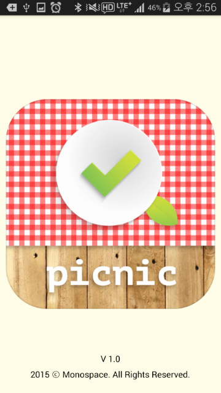
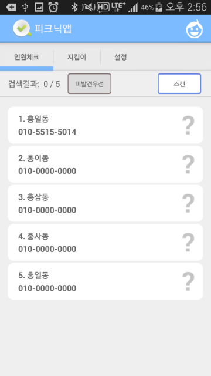
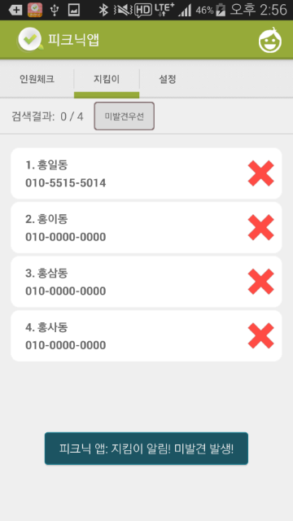

PicnicApp
=============

피크닉 앱은 블루투스 비콘을 스캔, 추적하는 앱입니다.

비콘이란 블루투스 신호를 지속적으로 주변에 송출하는 기기인데, 아동 또는 위치확인이 필요한 대상에게 장착한 뒤 이 앱으로 거리를 측정할 수 있습니다.
이 기능을 응용하여 미아방지, 인원체크 등을 할 수 있습니다.

2015 함께 서울 앱 공모전, 노력상(15위) 수상 성공! [링크][1]

 [1]: https://mplatform.seoul.go.kr/w/wnpzcontestapp/selectPageListWnpzContestApp.do
 
